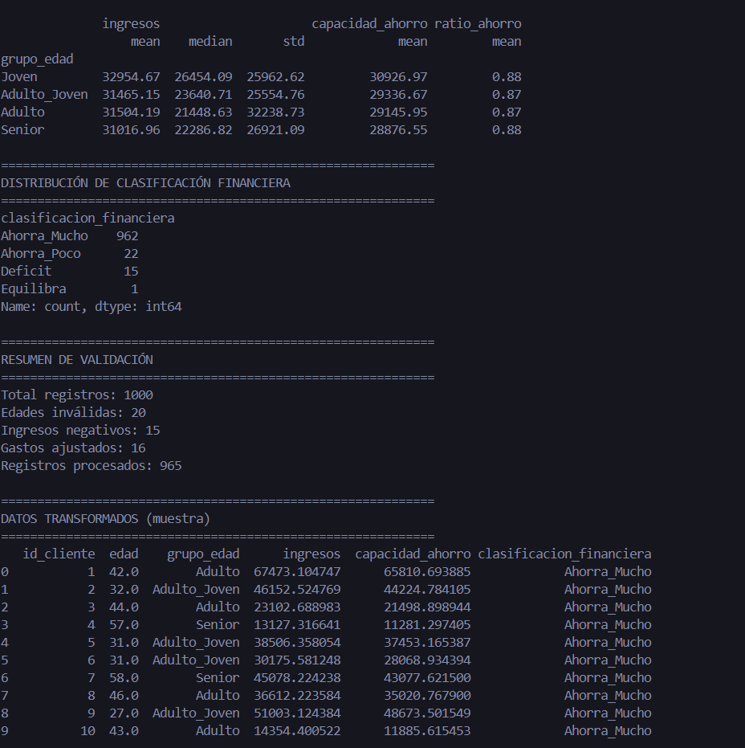

# Pipeline de Transformación de Datos

Pipeline completo de validación, transformación y enriquecimiento de datos de clientes usando Pandas y NumPy.

| Autor            | Fecha        | Día |
|------------------|--------------|----------|
| **Carlos Vásquez** |24 Noviembre 2025 | 3|
## Descripción

Este ejercicio implementa un pipeline ETL (Extract, Transform, Load) que procesa datos de clientes con problemas realistas, aplicando validaciones, correcciones y transformaciones para obtener un dataset limpio y enriquecido.

## Objetivos

- Identificar y corregir datos inválidos
- Aplicar reglas de negocio para validación
- Transformar y enriquecer información
- Generar métricas agregadas por categorías
- Documentar el proceso completo de limpieza

## Requisitos

```bash
pandas>=1.3.0
numpy>=1.21.0
```

### Instalación

```bash
# entorno virtual
pip python -m venv venv
# activar el entorno virtual
venv\Scripts\activate
# instalación pandas y numpy        
pip install pandas numpy
# respaldo de las dependencias
pip freeze > requeriments.txt
```

## Estructura del Dataset

### Datos Originales (1000 registros)

| Campo | Tipo | Descripción |
|-------|------|-------------|
| `id_cliente` | int | Identificador único |
| `edad` | int | Edad del cliente (18-80 años) |
| `ingresos` | float | Ingresos mensuales |
| `gastos_mensuales` | float | Gastos mensuales |
| `categoria_cliente` | str | Categoría A, B, C o D |
| `fecha_registro` | datetime | Fecha de registro |
| `email` | str | Correo electrónico |
| `telefono` | str | Número de teléfono |

### Errores Introducidos

- **20 registros** con edades inválidas (-5, 150, NaN)
- **15 registros** con ingresos negativos (-1000)
- **15 registros** con gastos superiores a ingresos (gastos = ingresos × 2)

## Proceso del Pipeline

### 1. Generación de Datos

Crea un dataset sintético con distribuciones realistas y errores intencionales para simular problemas del mundo real.

```python
n = 1000
df = pd.DataFrame({...})
```

### 2. Validaciones y Correcciones

#### Validación de Edades
- **Regla**: Edad entre 18 y 80 años
- **Acción**: Valores fuera de rango → `NaN`
- **Columna**: `edad_valida` (boolean)

#### Validación de Ingresos
- **Regla**: Ingresos ≥ 0
- **Acción**: Valores negativos → `NaN`

#### Validación Gastos vs Ingresos
- **Regla**: Gastos ≤ Ingresos
- **Acción**: Si gastos > ingresos → gastos = ingresos × 0.8
- **Columna**: `ratio_gasto_ingreso`

### 3. Transformaciones

#### Categorización por Edad
```python
grupo_edad = ['Joven', 'Adulto_Joven', 'Adulto', 'Senior']
bins = [18, 25, 35, 50, 80]

```

#### Métricas Financieras
- `capacidad_ahorro` = ingresos - gastos
- `ratio_ahorro` = capacidad_ahorro / ingresos

#### Clasificación Financiera
- **Ahorra_Mucho**: ratio > 0.3 (30%)
- **Ahorra_Poco**: ratio 0.1 - 0.3 (10-30%)
- **Equilibra**: ratio 0 - 0.1 (0-10%)
- **Deficit**: ratio < 0

#### Extracción de Información
- `codigo_area`: Extrae código de área del teléfono
- `antiguedad_dias`: Días desde el registro
- `antiguedad_meses`: Meses desde el registro

### 4. Métricas Agregadas

Análisis por grupo de edad:
- Media, mediana y desviación estándar de ingresos
- Capacidad promedio de ahorro
- Ratio promedio de ahorro

## 📈 Resultados Esperados

### Resumen de Validación
```
Total registros: 1000
Edades inválidas: 20
Ingresos negativos: 15
Gastos ajustados: 15
Registros procesados: ~965
```

### Columnas Generadas (7 nuevas)
1. `edad_valida` - Indicador boolean
2. `grupo_edad` - Categoría etaria
3. `ratio_gasto_ingreso` - Proporción gasto/ingreso
4. `capacidad_ahorro` - Monto disponible para ahorro
5. `ratio_ahorro` - Porcentaje de ahorro
6. `clasificacion_financiera` - Perfil financiero
7. `codigo_area` - Código telefónico
8. `antiguedad_dias` - Días como cliente
9. `antiguedad_meses` - Meses como cliente

## 🚀 Ejecución

```bash
python pipeline_transformacion.py
```
### Resultado Ejercicio



### Salida del Script

El script genera 5 secciones de salida:

1. **Datos Originales** - Primeras 5 filas del dataset
2. **Validaciones y Correcciones** - Conteo de errores corregidos
3. **Transformaciones** - Lista de nuevas columnas
4. **Métricas por Grupo** - Tabla agregada por edad
5. **Resumen Final** - Estadísticas de validación

## 📚 Conceptos Aplicados

### Pandas
- `apply()`, `loc[]` - Transformaciones condicionales
- `cut()` - Discretización de variables continuas
- `groupby()`, `agg()` - Agregaciones
- `str.extract()` - Expresiones regulares
- Operaciones con datetime

### NumPy
- Generación de datos aleatorios
- Distribuciones (normal, lognormal)
- `where()` - Lógica condicional vectorizada
- `clip()` - Límites de valores

### Reglas de Negocio
- Validación de rangos
- Consistencia entre variables relacionadas
- Imputación y corrección de errores
- Clasificación basada en umbrales

## 🔍 Casos de Uso

Este pipeline es útil para:
- **Finanzas**: Análisis de solvencia y capacidad crediticia
- **Marketing**: Segmentación de clientes
- **Riesgo**: Detección de perfiles financieros problemáticos
- **Auditoría**: Validación de integridad de datos
- **Reportería**: Métricas agregadas por segmentos

## 📝 Notas Técnicas

### Manejo de Valores Nulos
- Los valores inválidos se convierten a `NaN` para trazabilidad
- Las métricas calculadas propagan `NaN` automáticamente
- Los agregados excluyen `NaN` por defecto

### Rendimiento
- Operaciones vectorizadas para eficiencia
- Sin bucles explícitos en transformaciones
- Procesamiento de 1000 registros: < 1 segundo

### Extensibilidad
El pipeline es fácilmente extensible para:
- Agregar nuevas validaciones
- Incluir más transformaciones
- Incorporar fuentes de datos externas
- Exportar a diferentes formatos

## 🎓 Aprendizajes Clave

1. **Validación de datos** es crítica antes de análisis
2. **Reglas de negocio** deben estar explícitas y documentadas
3. **Transformaciones enriquecen** el valor de los datos
4. **Métricas agregadas** revelan patrones por segmentos
5. **Documentación del proceso** asegura reproducibilidad

## Quiz Ejercicio


## 📄 Licencia

Ejercicio educativo de código abierto.

---

**Autor**: Pipeline de Transformación de Datos  
**Versión**: 1.0  
**Fecha**: 2024
